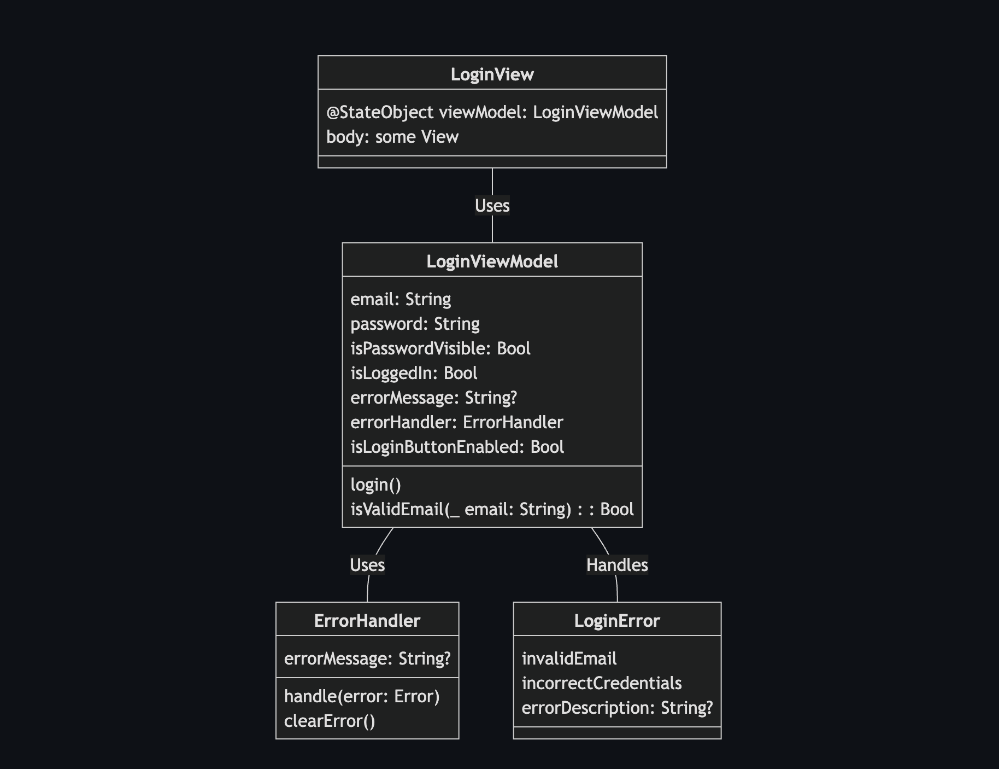
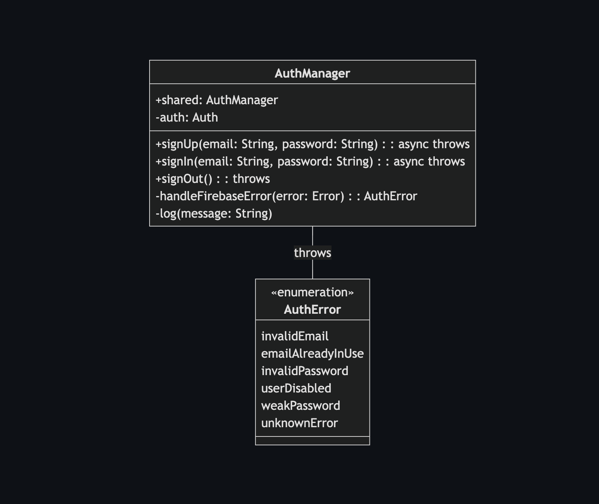
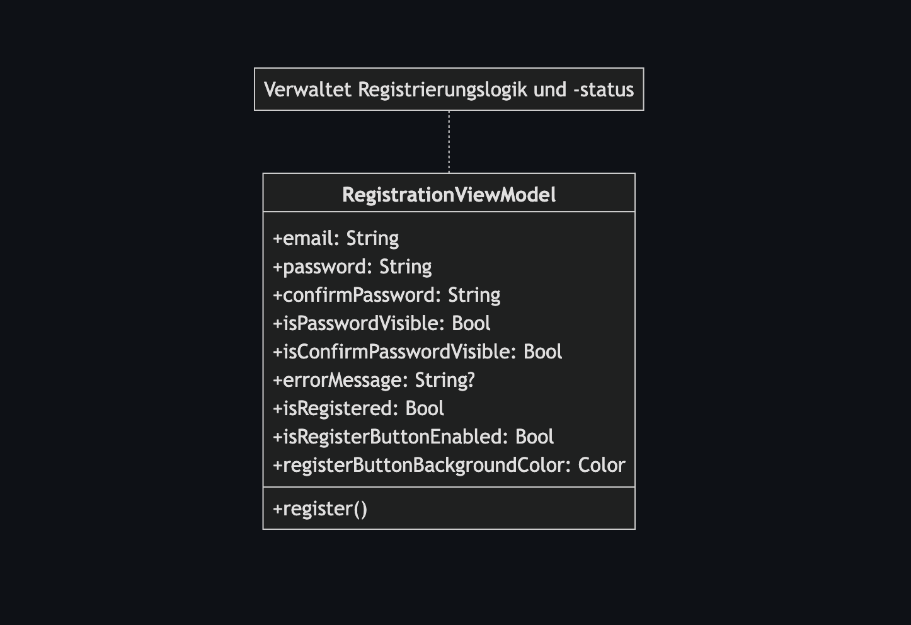
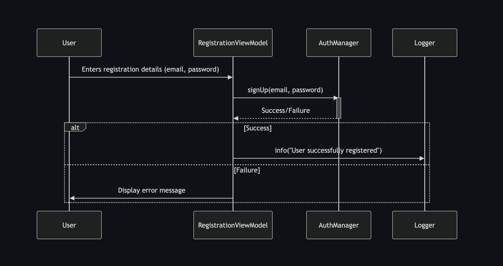

# WeatherTask - Deine smarte To-Do-App mit Wetterintegration

## 🌱 Overview

WeatherTask ist eine Swift-basierte Anwendung zur verbesserten Planung von Aufgaben. Die App integriert Wettervorhersagen und eine KI-gestützte Planungshilfe, um dir alternative Termine bei schlechtem Wetter vorzuschlagen.

## 📝 Introduction

WeatherTask hilft dir, deine Aufgaben intelligent zu planen. Ob Grillabend, Schwimmen oder Wandern – WeatherTask warnt dich bei schlechtem Wetter und schlägt einen besseren Termin vor.

## 🌄 Screenshots







## 🔄 Installation

### Run the Project in Xcode

Wenn du das Projekt lokal auf deinem Mac mit Xcode ausführen möchtest:

#### Schritte:

1. Repository klonen:
   ```bash
   git clone https://github.com/jchillah/weathertask.git
   ```
2. Projekt in Xcode öffnen:
   - Doppelklicke auf die `.xcodeproj`-Datei.
3. Zielgerät auswählen (Simulator oder echtes Gerät).
4. Projekt starten:
   - Drücke `Cmd + R` oder klicke auf den ▶️-Button in Xcode.

### 📑 API Keys einrichten

- **Wetter-API (OpenWeatherMap)**:
  - Registriere dich unter [https://openweathermap.org/](https://openweathermap.org/)
  - API-Schlüssel in `Config.swift` speichern
- **KI-API (optional OpenAI)**:
  - Registriere dich unter [https://openai.com/](https://openai.com/)
  - API-Key wie oben beschrieben speichern

## ✨ Features

- 📅 **Aufgabenmanagement** – Erstelle, bearbeite und archiviere Aufgaben
- ☀️ **Wetterintegration** – Zeigt das Wetter für den geplanten Tag an
- 🧠 **KI-gestützte Planung** – Gibt Warnungen bei schlechtem Wetter und schlägt bessere Termine vor
- 💾 **Lokale Speicherung (SwiftData)** – Speichert Aufgaben offline
- 🌐 **Cloud-Synchronisation (Firebase)** – Aufgaben über mehrere Geräte hinweg synchronisieren

## 🚀 Swift Technology Implementation

### UI & Architektur

- SwiftUI
- MVVM Architektur
- Swipe Gestures
- Lottie Animations (Geplant)

### Datenverwaltung & Cloud-Synchronisation

- SwiftData für lokale Speicherung
- Firebase Firestore für Cloud-Sync
- Firebase Authentication (optional)

### Networking & API-Integration

- URLSession für Wetter-API Abruf
- OpenWeatherMap API für Wetterdaten

### Performance & Hintergrundprozesse

- Swift Concurrency

### Sicherheit & Datenschutz

- Firebase Authentication für sichere Anmeldung

### KI & Smart Features (Zukünftige Implementierung)

- **Personalisierte Terminvorschläge** – KI-basierte Empfehlungen für optimale Tage
- Erste Implementierung: Firebase Firestore mit Regel-basierten Empfehlungen
- Erweiterung: Core ML für Machine Learning basierte Planung (zukünftig)

## 👤 Contact/Authors

(Michael Winkler / Jchillah)

