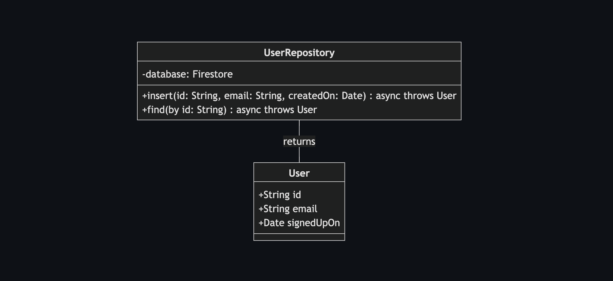
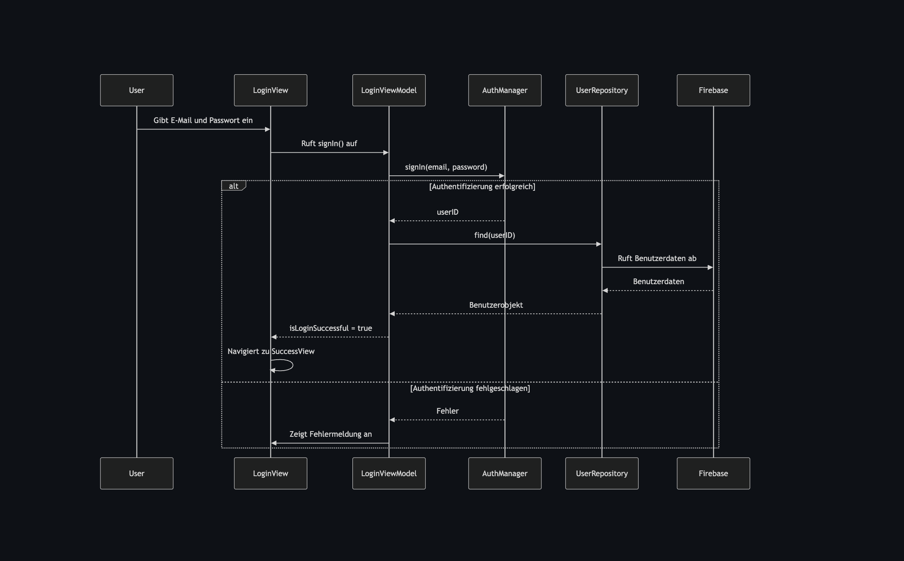

# WeatherTask - Deine smarte To-Do-App mit Wetterintegration

## 🌱 Überblick

WeatherTask ist eine Swift-basierte Anwendung zur verbesserten Planung von Aufgaben. Die App integriert Wettervorhersagen und eine KI-gestützte Planungshilfe, um dir alternative Termine bei schlechtem Wetter vorzuschlagen.

## 📝 Einführung

WeatherTask hilft dir, deine Aufgaben intelligent zu planen. Ob Grillabend, Schwimmen oder Wandern – WeatherTask warnt dich bei schlechtem Wetter und schlägt einen besseren Termin vor.

## 🌄 Screenshots

### Klassendiagramme
#### LoginViewModel

#### AuthManager

#### RegistrationViewModel

#### UserRepository


### Sequenzdiagramme
#### User Registration (Sign-Up)

#### User Login (Sign-In)


## 🔄 Installation

### 📥 Projekt in Xcode ausführen

Falls du das Projekt lokal auf deinem Mac mit Xcode ausführen möchtest, folge diesen Schritten:

1. **Repository klonen:**
   ```bash
   git clone https://github.com/jchillah/weathertask.git
   ```
2. **Projekt in Xcode öffnen:**
   - Doppelklicke auf die `.xcodeproj`-Datei.
3. **Zielgerät auswählen (Simulator oder echtes Gerät).**
4. **Projekt starten:**
   - Drücke `Cmd + R` oder klicke auf den ▶️-Button in Xcode.

### 🔑 API-Keys einrichten

Damit WeatherTask Wetterdaten abrufen kann, benötigst du API-Schlüssel für folgende Dienste:

- **Wetter-API (OpenWeatherMap):**
  - Registriere dich unter [OpenWeatherMap](https://openweathermap.org/)
  - Füge deinen API-Schlüssel in `Config.swift` ein.
  
- **KI-API (optional OpenAI):**
  - Registriere dich unter [OpenAI](https://openai.com/)
  - Speichere deinen API-Key wie oben beschrieben in `Config.swift`.

### 🔐 Firebase Authentication einrichten

WeatherTask nutzt **Firebase Authentication** für die Userregistrierung und das Login.

#### 🛠 Schritte zur Einrichtung:

1. **Gehe zur [Firebase Console](https://console.firebase.google.com/).**
2. Erstelle ein neues Firebase-Projekt oder wähle ein bestehendes.
3. Navigiere zu **Authentication** > **Sign-In Method**.
4. **Aktiviere "E-Mail/Passwort" als Anmeldemethode.**
5. Lade die `GoogleService-Info.plist` aus der Firebase-Konsole herunter und füge sie in dein Xcode-Projekt ein.
6. Installiere Firebase SDKs mit dem Swift Package Manager:
   - Gehe in Xcode zu **File** > **Add Packages**.
   - Füge `https://github.com/firebase/firebase-ios-sdk.git` als URL hinzu.
   - Wähle **FirebaseAuth** und **FirebaseFirestore**.
7. Initialisiere Firebase in `AppDelegate.swift`:
   ```swift
   import FirebaseCore

   @main
   class AppDelegate: UIResponder, UIApplicationDelegate {
       func application(_ application: UIApplication,
                        didFinishLaunchingWithOptions launchOptions: [UIApplication.LaunchOptionsKey: Any]?) -> Bool {
           FirebaseApp.configure()
           return true
       }
   }
   ```
8. Implementiere `AuthManager.swift` für die Benutzerverwaltung.

## ✨ Features

- 📅 **Aufgabenmanagement** – Erstelle, bearbeite und archiviere Aufgaben.
- ☀️ **Wetterintegration** – Zeigt das Wetter für den geplanten Tag an.
- 🧠 **KI-gestützte Planung** – Gibt Warnungen bei schlechtem Wetter und schlägt bessere Termine vor.
- 💾 **Lokale Speicherung (SwiftData)** – Speichert Aufgaben offline.
- 🌐 **Cloud-Synchronisation (Firebase)** – Synchronisiert Aufgaben über mehrere Geräte hinweg.

## 🚀 Technologien & Architektur

### 🎨 UI & Architektur

- SwiftUI für modernes UI-Design.
- MVVM-Architektur für sauberen Code.
- Swipe-Gesten für intuitive Bedienung.
- **(Geplant)** Lottie-Animationen für ein ansprechendes UI-Erlebnis.

### 📂 Datenverwaltung & Cloud-Synchronisation

- **SwiftData** für lokale Speicherung.
- **Firebase Firestore** für Cloud-Synchronisation.
- **Firebase Authentication** für Benutzerverwaltung.

### 🔗 Networking & API-Integration

- URLSession für den Abruf von Wetterdaten.
- OpenWeatherMap API für Wetterinformationen.

### ⚡ Performance & Hintergrundprozesse

- Swift Concurrency für asynchronen Code.
- Background Tasks für effizientes Datenladen.

### 🔒 Sicherheit & Datenschutz

- **Firebase Authentication** für sichere Benutzeranmeldung.
- **Verschlüsselte Speicherung** sensibler Daten.

### 🧠 Zukunftsplanung: KI & Smart Features

- **Personalisierte Terminvorschläge** – KI-basierte Empfehlungen für optimale Tage.
- Erste Implementierung: Firebase Firestore mit regelbasierten Empfehlungen.
- Erweiterung: **Core ML** für Machine-Learning-gestützte Planung (zukünftig).

## 👤 Kontakt & Mitwirkende

Entwickler: **Michael Winkler / Jchillah**  
Feedback & Anfragen: *Jchillah@gmail.com*  
GitHub Repository: [WeatherTask auf GitHub](https://github.com/jchillah/weathertask)

🚀 Viel Spaß mit WeatherTask! Plane smarter & stressfreier. 🎯☀️

